# Fiber Cement Cladding Intimately Attached to Wood Structural Panels with Integral Water Resistive Barrier in Moist or Marine Climates: Analyzing the Extent of Risk
#### https://uf-thesis-fibercement.github.io/UF-Thesis-FiberCement/
#### Author: Joel Esposito | UF CityLab Jacksonville | 2026
#### Committee: Dr. Karla Saldaña Ochoa, Dr. Ravi Srinivasan, Dr. Theresa Weston
## Abstract

It has been common practice to install fiber cement panels and trim in direct, intimate contact against water resistive barriers. This may present localized points of failure in the longevity or durability of the building envelope when wood-based sheathings are used.

## Problem Statement

How might we assess latent risk in the built environment by using machine learning to analyze a commonly used construction assembly in the Northeast Florida?

## Repository Structure

- `thesis.pdf` — Final version of the thesis.
- `chapters/` — Source files (LaTeX or Markdown) for each chapter.
- `figures/` — Diagrams and plots used in the thesis.
- `code/` — (If applicable) Code related to experiments or simulations.
- `data/` — (If applicable) Raw or processed data.

## Updates
### 2025-11-11 | Testing Sensors, Building Platform and Dessicant Enclosures
- Received sensors
- Cut and assembled dessicant enclosures (foil-faced poly-iso with foil-faced tape)
- Built mockup platform to test sun exposure
- Installed wood moisture sensors in sheathing with protected shims to facilitate inward vapor drive/molecular diffusion
- Tested sensor array
- Observed calibration delta between waterproof sensor and standard sensors (HT1 vs. HTw)
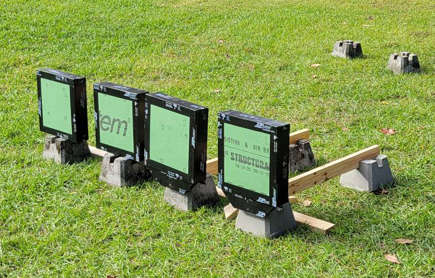

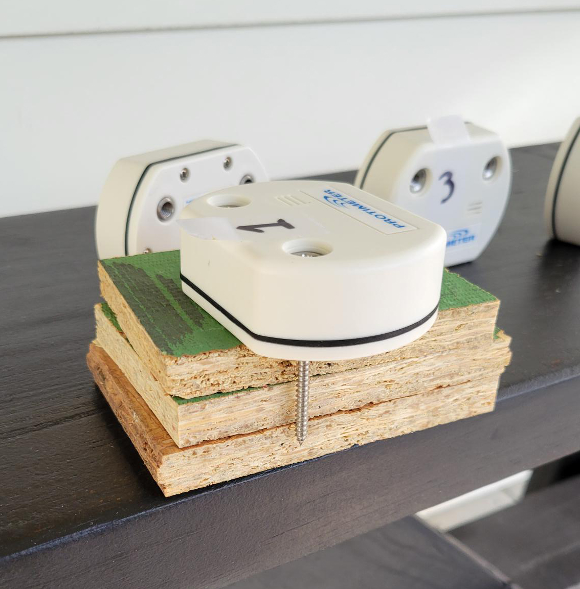

### 2025-10-20 | Building Test Panels
- Received materials
- Cut and assembled test panel frames
- Installed sheathing layer and flashing tape
- Cut and taped panel support gussets
- Painted drywall with two coats of interior paint and cut into panels
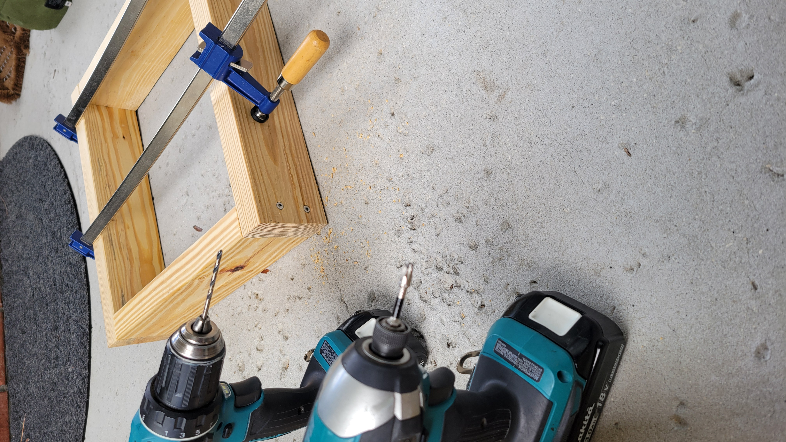
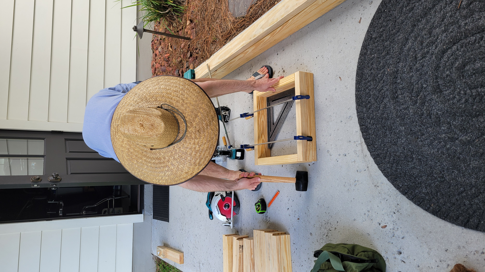
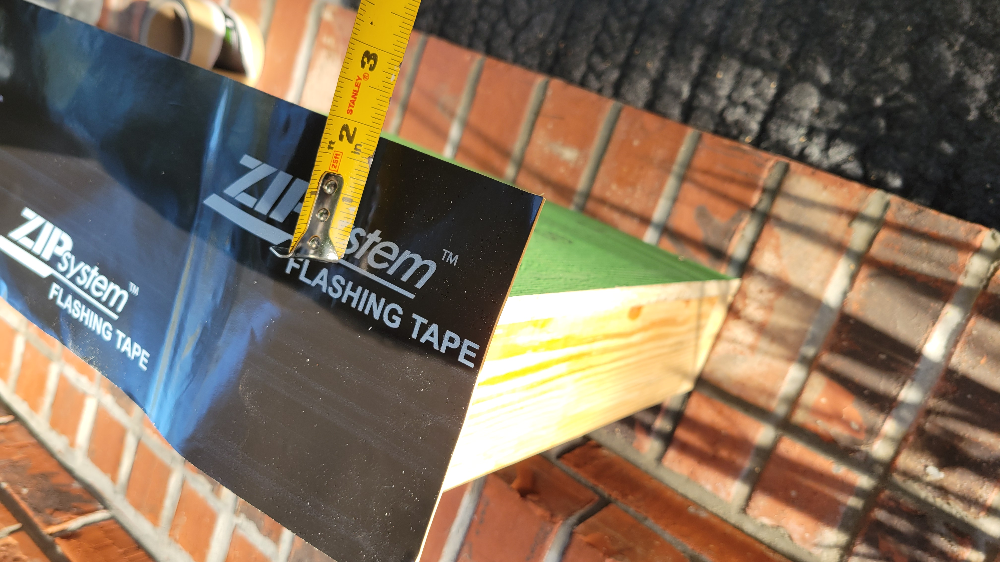

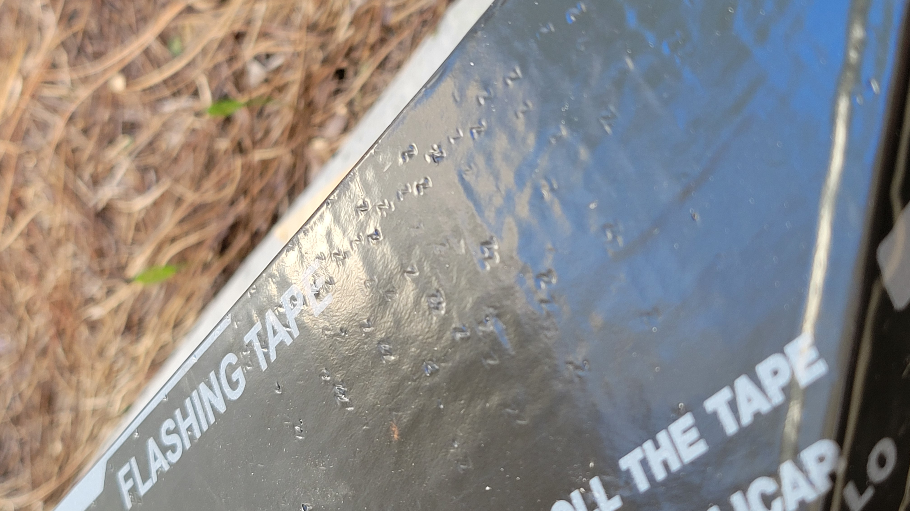
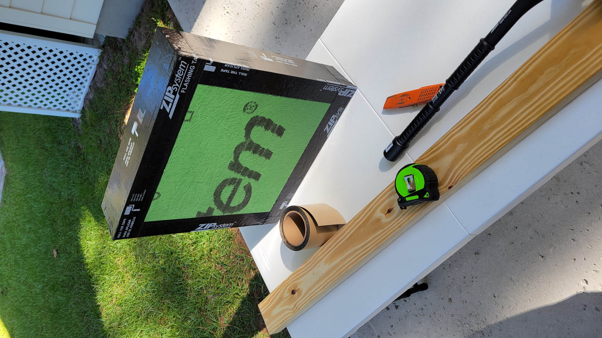
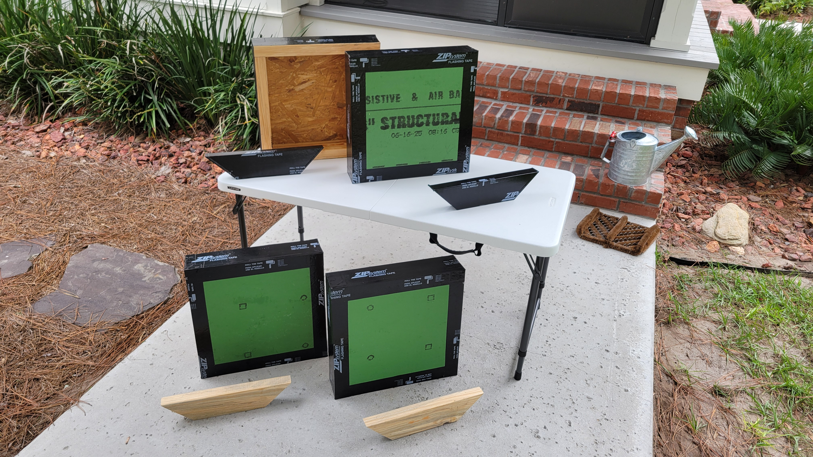
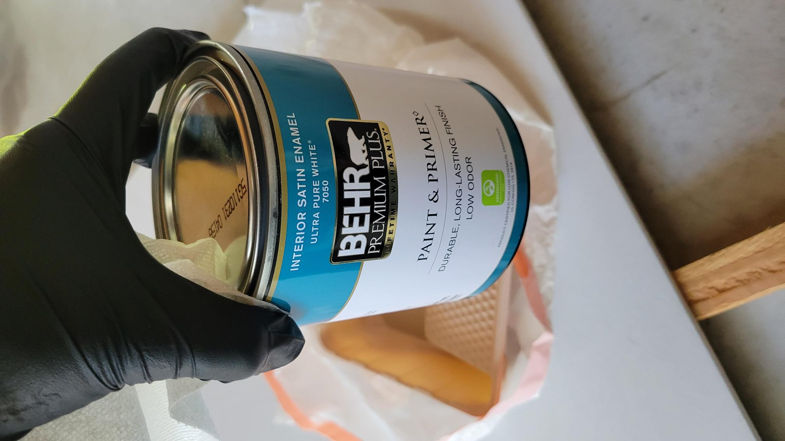
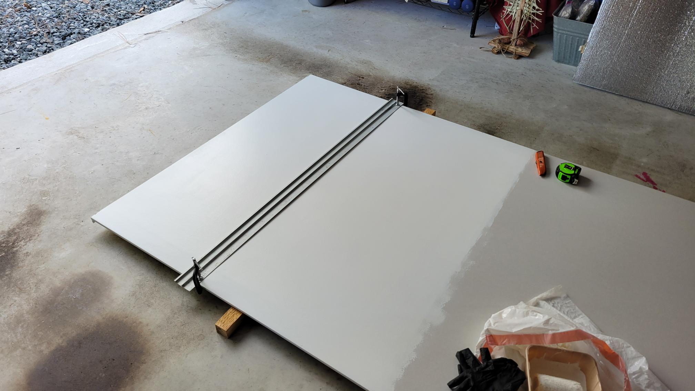

### 2025-10-2 | Building Test Panels
- Received ZipSystem sheathing from Huber Engineered Woods
- Pre-cut cladding and sheathing layers
- Finalized materails list and submitted for purchase
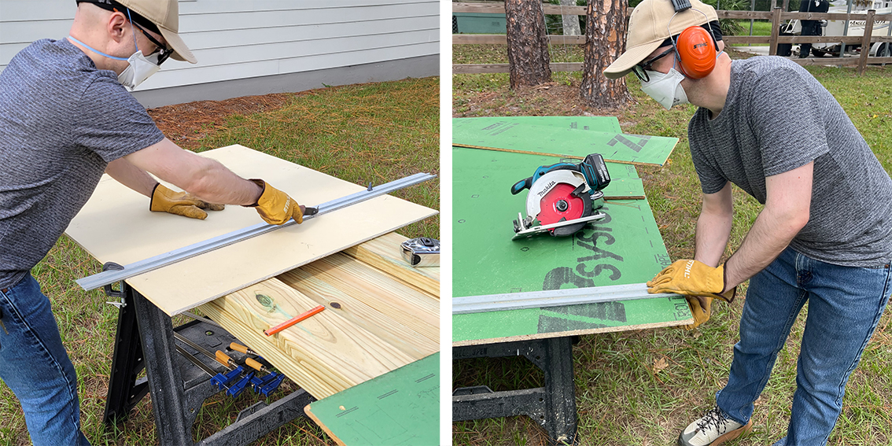

### 2025-9-16 | SHARE Lab Meeting
- Replied to Johns Manville to acquire insulation for use in the test walls
- Contacted ASTM to inquire about availability of a test method of interest for academic use
- Counted existing deck pier blocks to update materials shopping list
- Setup GitHub repository to track progress

## License

> The thesis text is licensed under [CC BY-NC-ND 4.0](https://creativecommons.org/licenses/by-nc-nd/4.0/).  
> See `LICENSE.md` for details.

## Author

Joel Esposito 
UF CityLab Jacksonville ("JaxLab")
2025
