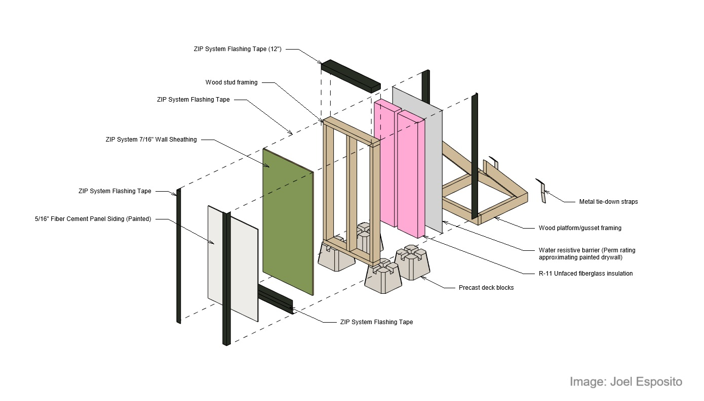

# Fiber Cement Cladding Intimately Attached to Wood Structural Panels with Integral Water Resistive Barrier in Moist or Marine Climates: Analyzing the Extent of Risk
#### https://uf-thesis-fibercement.github.io/UF-Thesis-FiberCement/

## Abstract

It has been common practice to install fiber cement panels and trim in direct, intimate contact against water resistive barriers. This may present localized points of failure in the longevity or durability of the building envelope when wood-based sheathings are used.

## Repository Structure (In Progress)

- `thesis.pdf` — Final version of the thesis.
- `chapters/` — Source files (LaTeX or Markdown) for each chapter.
- `figures/` — Diagrams and plots used in the thesis.
- `code/` — (If applicable) Code related to experiments or simulations.
- `data/` — (If applicable) Raw or processed data.

## 2025-9-16 | Tuesday, September 16, 2025
### SHARE Lab Meeting
- Replied to Johns Manville to acquire insulation for use in the test walls.
- Contacted ASTM to inquire about availability of a test method of interest for academic use.
- Counted existing deck pier blocks to update materials shopping list.
- Setup GitHub repository to track progress
 

## License

> The thesis text is licensed under [CC BY-NC-ND 4.0](https://creativecommons.org/licenses/by-nc-nd/4.0/).  
> See `LICENSE.md` for details.

## Author

Joel Esposito 
UF CityLab Jacksonville ("JaxLab")
2025
